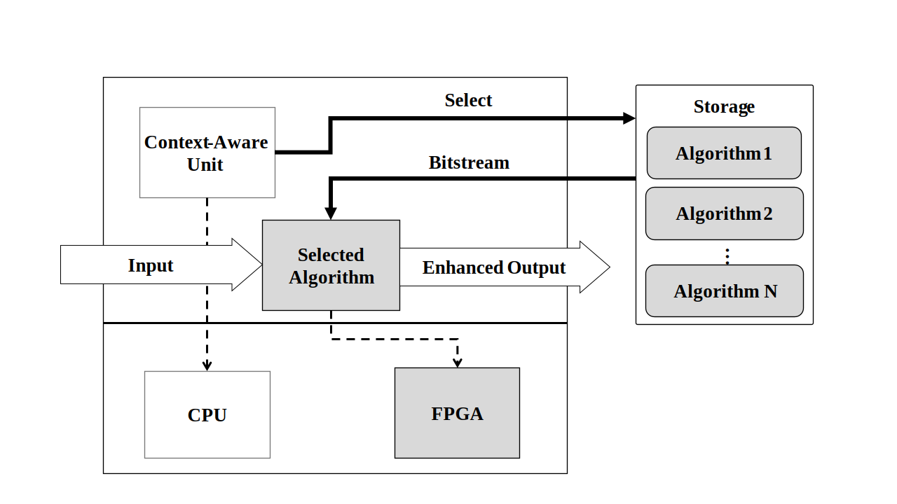

# A Context-Aware Speech Enhancement FPGA-SoC-Based Architecture
&emsp;&emsp;&emsp;&emsp;&emsp;&emsp;&emsp;&emsp;
## Introduction
Modern embedded systems have a complex structure and have application in many fields including aerospace, control, digital signal processing, etc. Recent advancements in design tools and increasements in computational power of the implementation platforms have allowed these systems to move towards self-adaptivity which allows the system to adjust its behaviour and priorities during runtime to meet design goals. context-aware systems are one of the types of adaptive systems that can adapt their operations according to the current system context. Utilizing context-awareness in embedded systems in middleware and hardware layers can save computational resources and improve quality metrics such as performance and reliability. One of the prominent application fields for adaptive embedded systems is digital signal processing where the operating environment properties are time-varying. FPGAs are suitable candidates for implementing such systems because of features like runtime reconfigurability, parallel processing, and high internal bandwidth.  
In speech enhancement and many other signal processing applications, because of parameters like design constraints and goals, the most appropriate processing algorithm at a time might vary according to system context. Due to the resource limitations in embedded systems implementation platforms, in most cases, simultaneous implementation of multiple algorithms might not be optimal or achievable.  
In this project an FPGA-SoC-based context-aware architecture with application in speech enhancement along with its supporting model-based design flow is presented. Employment of model-based design flow and a high-level synthesis (HLS) tool in presented architecture allows straightforward implementation from high-level models. presented architecture can be customized for similar DSP applications and allows the designers and developers of this domain to design and implement their desired context-aware system.  

 <i> Fig.1. Overview of proposed FPGA-SoC system. </i> 

The overall structure of the presented system is demonstrated in Fig. 1. According to Fig. 1, a set of complementary algorithms exist on system storage as bitstreams. The software part of the system which undertakes context-awareness monitors system context e.g. noise level and source and configures the FPGA with the proper algorithm according to system context.  
In this project, as the running example, a speech enhancement system consisting of two well-known algorithms namely Multiband Spectral Subtraction (MBSS) and Minimum Min Square Error (MMSE) is implemented according to the design flow. Context-awareness is based on a Tensorflow machine-learning model that is trained for different operational environments in terms of noise source and level. The PESQ score is chosen for the quality measure and preference criterion for each algorithm.
## Background
Speech enhancement algorithms use mathematical and statistical tools combined with digital signal processing techniques to estimate and suppress noise from the degraded signal. In speech enhancement algorithms that deal with additive noise, it is assumed that noisy input signal in time domain .svg) consists of clean signal .svg) which is corrupted by additive noise .svg), that is:  

  

Due to rapid changes in temporal and spectral characteristics of speech signals, most enhancement algorithms operate on a frame-by-frame basis. Usually, the frame duration is 10-30 milliseconds during which the properties of the speech signal do not change much. Many speech enhancement algorithms function in the frequency-domain by transferring raw time-domain input signal via the fast Fourier transform (FFT) algorithm that due to its inherent parallelism, is suitable for hardware implementation.
### Speech enhancement algorithms
Two important classes of speech enhancement algorithms are (1) Spectral subtractive algorithms that are simple to implement. These algorithms function based on the principle that additive noise spectrum can be estimated and subtracted from the noisy speech signal. This can be expressed as:  

  

  
where .svg) is the estimate of magnitude noise spectrum and .svg) is the enhanced magnitude spectrum. (2) Statistical-model-based algorithms that view speech enhancement as a statistical estimation problem. These algorithms estimate the clean speech spectrum by multiplying the noisy speech spectrum by a gain function and have the following general form:

  

where the gain function .svg) can vary for each statistical-model-based algorithm e.g., for the MMSE algorithm, the gain function .svg) is dependent on subfunctions to estimate the a posteriori SNR  and the a priori SNR  parameters. The enhanced speech signal can be reproduced in time domain by taking the inverse Fourier transform of estimated clean speech spectrum _hat.svg).
\subsection{Noise estimation}
As stated earlier, both MMSE and MBSS algorithms require a posterior estimate of the noise spectrum. To estimate the noise spectrum noise estimation algorithms that in each frame estimate and update noise spectrum can be used. A simple yet effective noise estimation algorithm is presented by Arslan et al.\cite{arslan_NE} with following form:
\begin{equation}\label{eq:NE}\begin{split}
&S_{tmp}(\lambda, k) = \alpha \hat{\sigma}_d(\lambda-1,k)+(1-\alpha)|Y(\lambda,k)|\\
&\text{if } \hat{\sigma}_d(\lambda-1,k) < \beta S_{tmp}(\lambda,k) \text{ and } \hat{\sigma}_d(\lambda-1,k) > \gamma S_{tmp}(\lambda,k)\\
&\indent \hat{\sigma}_d(\lambda,k) = S_{tmp}(\lambda, k)\\
&\text{else}\\
&\indent \hat{\sigma}_d(\lambda,k) = \hat{\sigma_d}(\lambda-1,k)
\end{split}
\end{equation}
Above algorithm updates the estimated noise spectrum \(\hat{\sigma}_d(\lambda,k)\) by comparing it to estimation from previous frame and checking if it lies within a specific boundary which is dermined by \(\beta\) and \(\gamma\) thresholds.

In addition to a posteriori SNR, The MMSE algorithm also reqires a priori SNR estimation algorithm. The decision-directed approach\cite{MMSE} is one of the methods available for estimating a priori SNR and is given by:
\begin{equation} \label{eq:DD}
    {\hat{\xi}}_k(m)\ =\ \alpha\frac{{\hat{X}}_k^2(m\ -1)}{\lambda_d(k\ ,\ m\ -\ 1)}+(1-\alpha)max[\ \gamma_k(m)-1,\ 0]
\end{equation}
where \( 0 < \alpha < 1\) is the weighting factor and \({\hat{X}}_k^2(m\ -1)\) and \(\lambda_d(k\ ,\ m\ -\ 1)\) are the enhanced speech amplitude and the noise power that are obtained in the past frame, respectively.
## System Architecture
## Designflow
## Development Process
